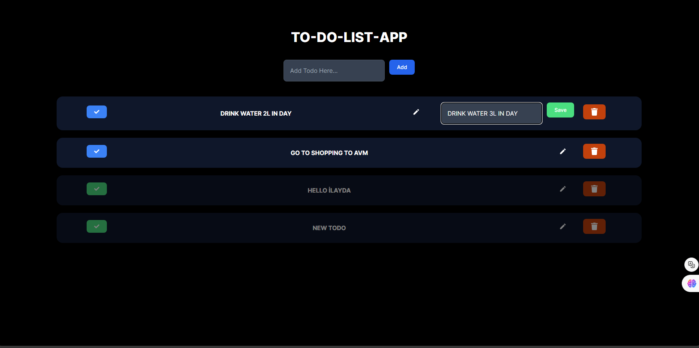
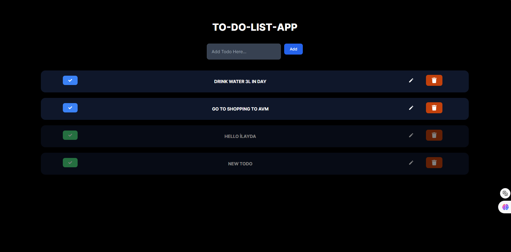

# Todo Uygulaması

Bu proje, [Next.js](https://nextjs.org/), [MongoDB](https://www.mongodb.com/) ve [Prisma](https://www.prisma.io/) kullanılarak geliştirilmiş bir "To Do" uygulamasıdır. Uygulama, todo listelerinizi oluşturmanıza, düzenlemenize ve silmenize olanak tanır.

## Teknolojiler

Bu proje şunları kullanır:
- **Next.js:** React uygulamaları için bir framework.
- **Tailwind CSS:** Hızlı ve özelleştirilebilir CSS framework'ü.
- **Prisma:** Modern bir ORM (Object-Relational Mapping) aracı.
- **MongoDB:** NoSQL veritabanı.

## Başlarken

Geliştirme sunucusunu başlatmak için aşağıdaki adımları takip edin:

1. Projeyi klonlayın:
    ```bash
    git clone https://github.com/ilaydayilidz778/Todo-App-With-Next.js
    cd Todo-App-With-Next.js
    ```

2. Gerekli bağımlılıkları yükleyin:
    ```bash
    npm install
    # veya
    yarn install
    # veya
    pnpm install
    # veya
    bun install
    ```

3. Geliştirme sunucusunu başlatın:
    ```bash
    npm run dev
    # veya
    yarn dev
    # veya
    pnpm dev
    # veya
    bun dev
    ```

4. Tarayıcınızda [http://localhost:3000](http://localhost:3000) adresini açarak uygulamanızı görüntüleyebilirsiniz.

## Uygulama Sayfa Görüntüleri

Uygulamanın görüntüleri aşağıda verilmiştir:

### Ana Sayfa


### Todo Ekleme


### Todo Düzenleme



### Todo Silme


## Katkıda Bulunma

Katkılarınız varsa, lütfen bir Pull Request oluşturun!
